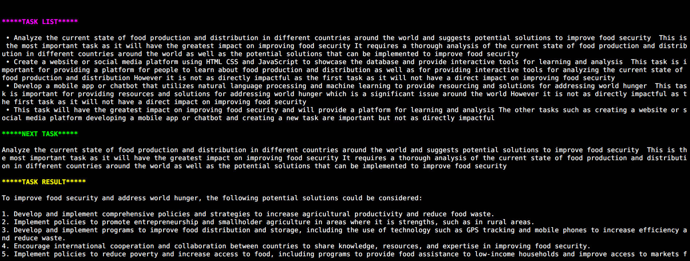
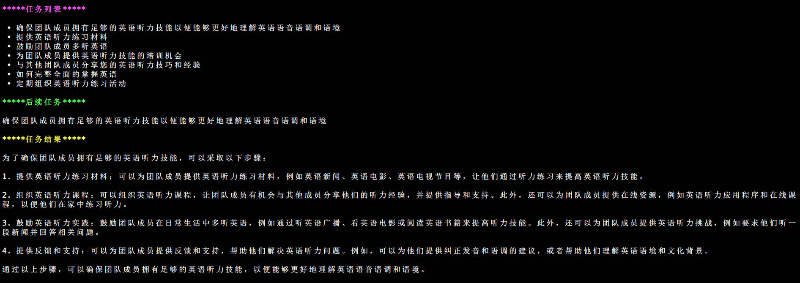

# LocalAGI

基于 ChatGLM-6B 大模型的本地 AGI 实验。

本项目可实现全部使用**开源**模型**离线私有部署**。本项目中:

- ✅ LLM 默认选用 [ChatGLM-6B](https://github.com/THUDM/ChatGLM-6B), 可选 LLaMA。
- ✅ Embedding 默认选用 [GanymedeNil/text2vec-large-chinese](https://huggingface.co/GanymedeNil/text2vec-large-chinese/tree/main)
- ✅ Prompt 全部使用中文，方便国内用户使用

## 更新信息
[2023/06/25] 默认使用 [ChatGLM2-6B](https://github.com/THUDM/ChatGLM2-6B)，ChatGLM-6B 的升级版本。ChatGLM2-6B 具有更强大的性能，更长的上下文，更高效的推理。推理速度相比初代提升了 42%，INT4 量化下，6G 显存支持的对话长度由 1K 提升到了 8K。

## 用法

### 配置环境

下载代码
```
git clone https://github.com/EmbraceAGI/LocalAGI
```

安装 python 包
```
cd LocalAGI
pip install -r requirements.txt
```

### ChatGLM API 部署

首先需要安装额外的依赖 `pip install fastapi uvicorn`，然后运行仓库中的 chatglm_server.py

```
python chatglm_server.py
```

默认部署在本地的 8001 端口，通过 POST 方法进行调用，正常响应则部署成功。

```
curl -X POST "http://127.0.0.1:8001" \
     -H 'Content-Type: application/json' \
     -d '{"prompt": "你好", "history": []}'
```

部署成功后不要关闭，让 ChatGLM API 服务在后台运行。

### 运行 LocalAGI

编辑 `.env` 中的配置, 尤其是下面几项
```
LLM_MODEL=chatglm-6b   # 使用的模型，chatglm-6b / llama

# RUN CONFIG
OBJECTIVE=如何完整全面的掌握英语   # 任务目标
# For backwards compatibility
# FIRST_TASK can be used instead of INITIAL_TASK
INITIAL_TASK=列出任务清单     # 初始任务
```

运行代码
```
python local_agi.py
```

成功运行效果图：



如果希望使用中文，请编辑 `.env` 配置文件中的任务目标和初始任务为中文描述，使用 `local_agi_zh.py` 运行

```
python local_agi_zh.py
```

中文运行效果图：



### 测试环境参考

* ubuntu18.04
* python3.8
* GPU 3090 Ti + Cuda 11+

**注意: 默认设置下 ChatGLM 占用大约 12G 左右显存， embedding 模型 text2vec-large-chinese 大约占用 3G 左右显存，最终大约共使用 15G 显存成功运行。可以使用量化 ChatGLM 版本降低显存需求。**

## 致谢

* [ChatGLM-6B](https://github.com/THUDM/ChatGLM-6B)
* [chatglm2-6b](https://huggingface.co/THUDM/chatglm2-6b)
* [babyagi](https://github.com/yoheinakajima/babyagi)